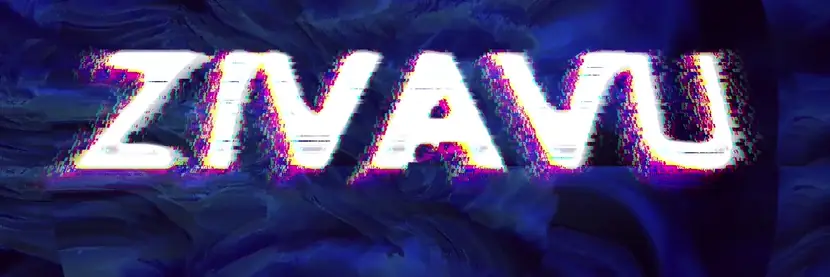
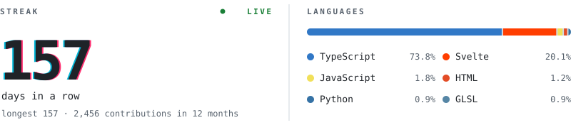

Hi, I'm Tomasz, a frontend dev currently at Capgemini. Mostly TypeScript and React, learning Python on the side. AI enjoyer.

After work I write things for the GPU and then break them on purpose.

### OpenMosh

A glitch art studio that runs in your browser. Drop in a photo or a video, stack effects until it falls apart, hook it up to a song and export a WebM. There are 68 WebGL2 effects, and their parameters can be wired to frequency bands of the song. Your files never leave your machine.

The banner up there came out of it, and so did every visualizer on my YouTube.

[Try it](https://open-mosh.vercel.app) · [Source](https://github.com/zivavu/OpenMosh) · Svelte 5, TypeScript, WebGL2, Web Audio

### Also

[Clonagram](https://github.com/zivavu/Clonagram) is Instagram rebuilt with Next.js and Supabase: feed, reels, stories, realtime DMs and an in-browser image editor. [Live demo](https://clonagram.vercel.app)

 

<picture>
  <source media="(prefers-color-scheme: dark)" srcset="assets/stats-dark.svg">
  
</picture>

 

Music visualizers on [YouTube](https://www.youtube.com/@zivavu144) (lots of flashing, you've been warned) · zivavu@gmail.com
